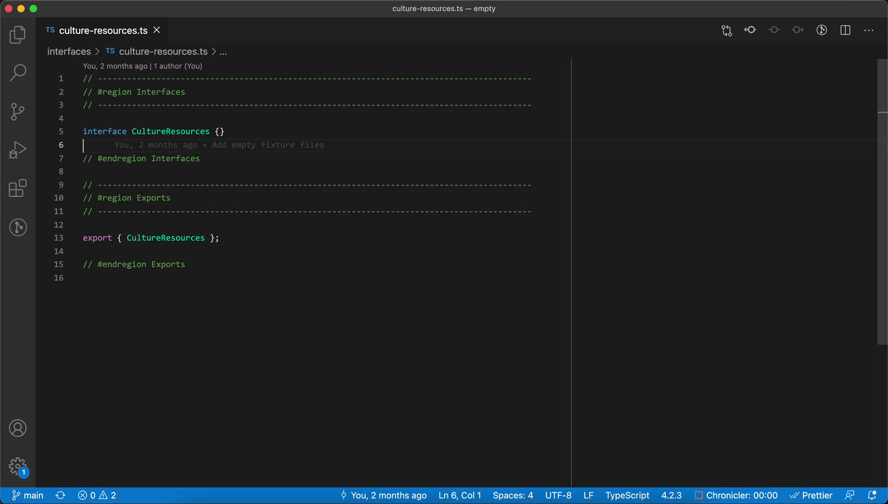
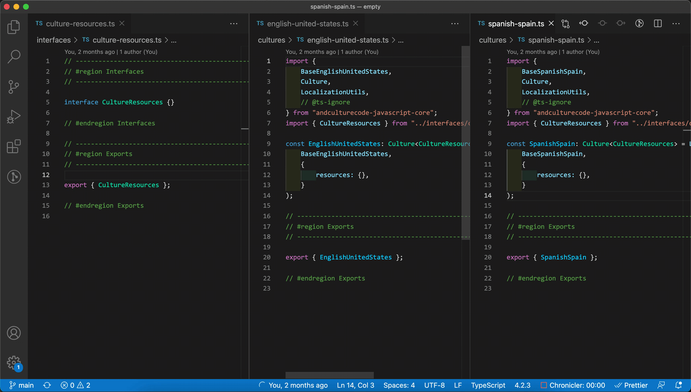
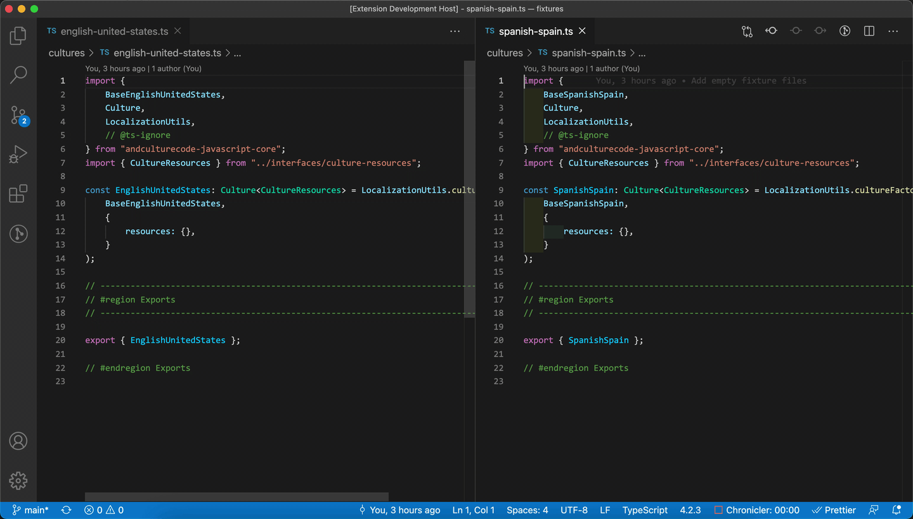

<p align="center">
    
    <br/>
    <a href="https://github.com/brandongregoryscott/kazoo/actions/workflows/build.yaml">
        
    </a>
    <a href="https://github.com/prettier/prettier">
        
    </a>
    <a href="http://www.typescriptlang.org/">
        
    </a>
</p>

VS Code extension to ease the burden of adding localized keys and strings to multiple typed culture files

## Features

-   Add key to interface

    -   Prompts the user for a key to add to the interface specified in the extension settings.



-   Add key to interface and translation to culture files

    -   Prompts the user for a key and translation to add to the interface and culture files specified in the extension settings.



-   Add translation to culture files
    -   Prompts the user for a key and translation to add to each file specified in the extension settings.



-   Replace translations from JSON

    -   Prompts the user to select a culture file to update with values from a JSON object in the same structure.


## Requirements

-   Assumes the culture files are initialized using an object in the structure of the [`Culture`](https://github.com/AndcultureCode/AndcultureCode.JavaScript.Core/blob/main/src/interfaces/culture.ts) interface from [`andculturecode-javascript-core`](https://github.com/AndcultureCode/AndcultureCode.JavaScript.Core)

```ts
import {
    BaseEnglishUnitedStates,
    Culture,
    LocalizationUtils,
} from "andculturecode-javascript-core";
import CultureResources from "utilities/interfaces/culture-resources";

const EnglishUnitedStates: Culture<CultureResources> = LocalizationUtils.cultureFactory(
    BaseEnglishUnitedStates,
    {
        resources: {
            accountInformation: "Account Information",
            cancelMySubscription: "Cancel My Subscription",
            checkOutFaq: "Check out our FAQs",
            subscriptionDetails: "Subscription Details",
            teamManagement: "Team Management",
        },
    }
);
```

## How it works

This extension leverages [`ts-morph`](https://github.com/dsherret/ts-morph) under the hood to read & manipulate the TypeScript AST. This means that you don't need the interface or culture files open in your VS Code window for it to perform the manipulations.

> It also means that it manipulates the files from their saved versions on disk - if you have open but unsaved changes in your editor, it's going to yell at you when you try to save because the file on disk will be newer than the version in your editor.

For translating non-English copy, the extension leverages [`@vitalets/google-translate-api`](https://github.com/vitalets/google-translate-api), determining which language to translate to based on the base culture being extended from [`andculturecode-javascript-core`](https://github.com/AndcultureCode/AndcultureCode.JavaScript.Core) (currently supporting Spanish, but can be easily updated).

## Settings

This extension supports the following configuration settings:

-   `kazoo.cultureFilePaths`: Array of paths/glob patterns to culture files
    -   Default: `**/cultures/*.ts`
-   `kazoo.cultureInterfacePath`: Path/glob pattern to interface defining typed i18n keys
    -   Default: `**/interfaces/culture-resources.ts`
-   `kazoo.insertionPosition`: Position to insert key/translation into file
    -   Default: `Loose Alphabetical` (Inserts key in best guess alphabetical order, assuming file is already sorted)
