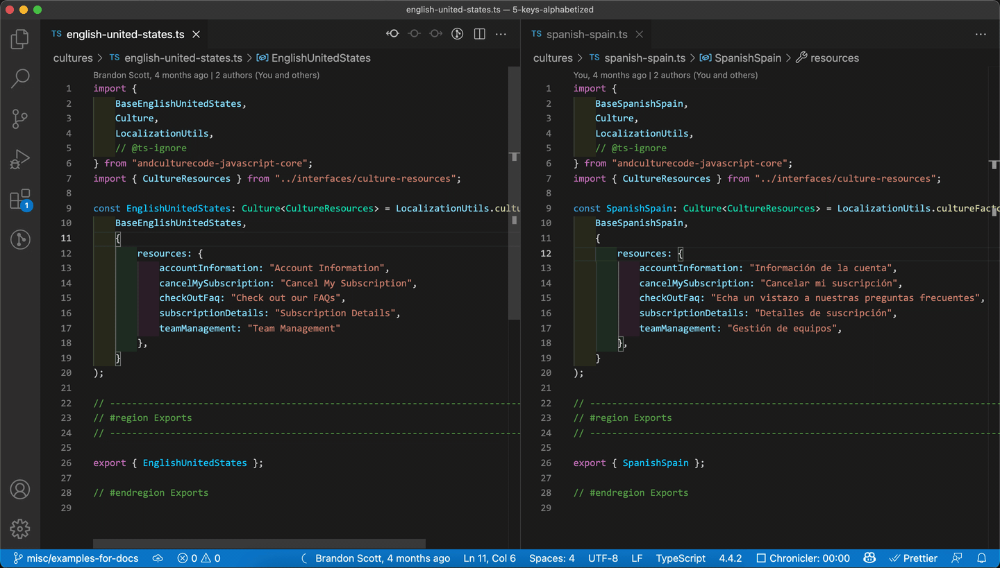

# Commands > Remove translation from culture files

## Overview

Prompts the user for a key to remove from the project's culture files.

## Demo



## Notes

-   The list of keys is aggregated from all culture files, which means you might select a key that does not exist in the specified culture file. For example:

<!-- prettier-ignore -->
```ts
// english-united-states.ts
resources: {
    "aboutApp": "About {{appName}}",
    "addTo": "Add to {{container}}",
}

// spanish-spain.ts
resources: {
    "aboutApp": "Acerca de {{appName}}",
}
```

-   The user would be prompted to select either `aboutApp` or `addTo` as a key to remove.
-   If the key `addTo` was selected along with `spanish-spain.ts`, no modifications would be made, since the key only exists in `english-united-states.ts`
-   The key will be removed from all culture files that it is found in.

## Related settings

-   The culture files are determined by the path(s) or glob pattern(s) specified in the extension's [settings](../settings/culture-file-paths).
