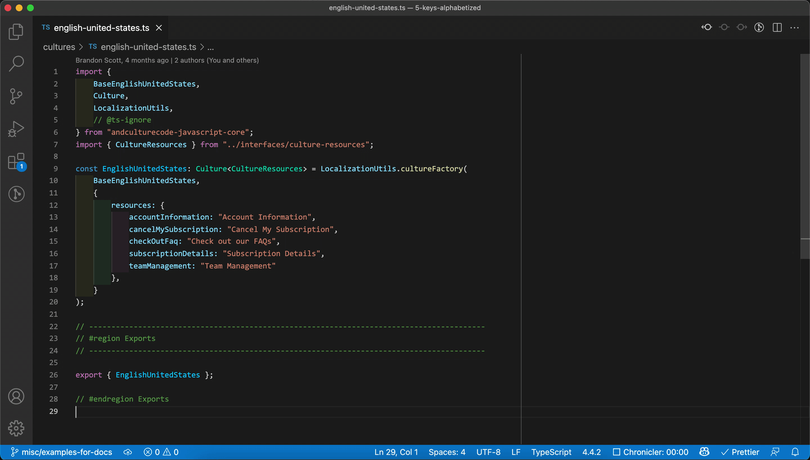

# Commands > Replace translation by key

## Overview

Prompts the user to select a key to replace copy for in a specific culture file.

## Demo



## Notes

-   The list of keys is aggregated from all culture files, which means you might select a key that does not exist in the specified culture file. For example:

<!-- prettier-ignore -->
```ts
// english-united-states.ts
resources: {
    "aboutApp": "About {{appName}}",
    "addTo": "Add to {{container}}",
}

// spanish-spain.ts
resources: {
    "aboutApp": "Acerca de {{appName}}",
}
```

-   The user would be prompted to select either `aboutApp` or `addTo` as a key to update.
-   If the key `addTo` was selected along with `spanish-spain.ts`, no modifications can be made, since the key only exists in `english-united-states.ts`. A warning message should display.

## Related settings

-   The culture files are determined by the path(s) or glob pattern(s) specified in the extension's [settings](../settings/culture-file-paths).
