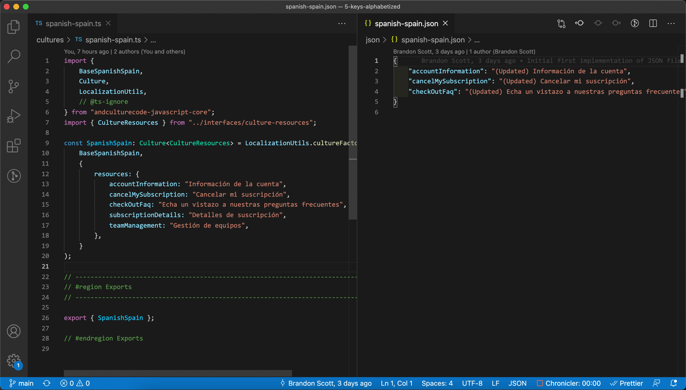

# Commands > Replace translations from file

## Overview

Prompts the user to select a culture file to update with values from a file.

## Demo



## Notes

-   Currently supported files are `.xlsx` and `.json`, and they should exist somewhere in the workspace directory.
-   Any keys that are found in the file that don't exist in the original culture file will **not** be added, and a warning will be displayed.
-   For json files, there should be a single object with string keys and values to be parsed, similar to the way the culture files are defined.

```json
{
    "accountInformation": "(Updated) Información de la cuenta",
    "cancelMySubscription": "(Updated) Cancelar mi suscripción",
    "checkOutFaq": "(Updated) Echa un vistazo a nuestras preguntas frecuentes"
}
```

-   For Excel files, there should be **two** columns, the first being the key to replace, and the second being the updated copy.

```md
| Key                  | Value                                                     |
| -------------------- | --------------------------------------------------------- |
| accountInformation   | (Updated) Información de la cuenta                        |
| cancelMySubscription | (Updated) Cancelar mi suscripción                         |
| checkOutFaq          | (Updated) Echa un vistazo a nuestras preguntas frecuentes |
```

-   Note that the header columns are for display/formatting purposes only - the extension does not treat the first row any different than the rest of the file. It will try to replace the value for the given key, if it exists.

## Related settings

-   The culture files are determined by the path(s) or glob pattern(s) specified in the extension's [settings](settings/culture-file-paths).
